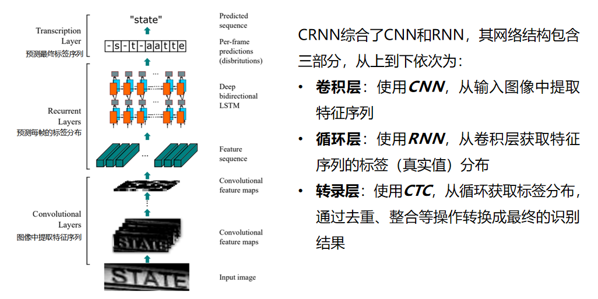

# 南华大学2022年机器学习课设

*作者：南华大学本20软卓01班李奕星(20200440717)*

## 1.课程设计选题分析

- 赛题任务：设计针对商业银行身份证识别的OCR系统，识别身份证中姓名、地址、身份证号码和身份证有效日期等信息。
- 任务难点：
  - 图像质量参差：黑白复印件与彩色照片混杂，影像清晰度不尽相同
  - 文字重叠：商业银行为保护客户信息时常在保存影像件时叠加水印，给文字识别带来困难

## 2.神经网络深度学习原理

### 2.1什么是神经网络

神经网络：人工神经网络是受到人类大脑结构的启发而创造出来的计算机网络，这也是它能拥有真智能的根本原因。

人工神经元：接收多个输入在处理后转化为一个输出结果，如图


深度神经网络：这里的深度是指层数多，层数越多那么构造的神经网络就越复杂。

深度学习：训练深度神经网络的过程就叫做深度学习。

### 2.2神经网络如何进行预测

如何将数据输入到神经网络？：先将待处理的数据（图像或音频）转化为一个n维的特征向量，然后再利用激活函数预处理成合理的输入数据

神经网络是如何进行预测的？：将处理好的数据使用公式z = dot(w,x) + b预测，x是我们处理好的输入特征向量；w代表权重，代表对应特征的重要程度；b代表阈值，用来影响修正预测结果；z就是我们的预测结果。

### 2.3如何判断是否预测准确

损失函数：用来判断单个预测结果是否准确，损失函数运算后结果越大说明偏差越大，代表预测精度越低；损失函数值越小越代表预测结果越准确。

成本函数：衡量预测算法对整个训练集的预测精度，对每个样本的损失累加求平均值，成本函数计算结果越大说明成本越大，预测越不准确。

### 2.4神经网络如何进行学习

- 梯度下降算法：一步一步改变w和b的值，让损失函数输出的结果更加小

- 神经网络的计算：由一个向前传播和一个反向传播构成
  - 前向传播：计算出预测结果以及损失
  - 反向传播：计算出损失函数对每一个参数的偏导数并且进行梯度下降
  - 更新参数：更新数据后再一次进行前向传播

- 学习公式：w = w - r*d(w)d(w)是w关于J的偏导数r表示算法的学习率，防止出现步长太大或者太小的情况


## 3.OCR基本原理

### 3.1 什么是OCR？

OCR英文全称是Optical Character Recognition，中文叫做光学字符识别。它是利用光学技术和计算机技术把印在或写在纸上的文字读取出来，并转换成一种计算机能够接受、人又可以理解的格式。

### 3.2OCR的常用步骤流程

- 图像预处理：将图片预处理进行角度的矫正与降噪

- ⾏列切割：对⽂档版⾯进⾏分析，进每⼀⾏进⾏⾏分割，把每⼀⾏的⽂字切割下来，最后再对每⼀⾏⽂本进⾏列分割，切割出每个字符

- 字符识别：将字符送⼊训练好的OCR识别模型进⾏字符识别，得到结果

- 后处理识别矫正：进⾏识别结果的矫正和优化

### 3.3CRNN——卷积循环神经网络结构



### 3.4CNN——卷积层


### 3.5RNN——循环层


### 3.6CTC loss——转录层


### 3.7场景文本监测模型——CTPN


## 4.代码模块分析

### 4.1CRNN网络训练模块


### 4.2CTPN文本监测训练模块


### 4.3数据存储与生成模块


### 4.4图像分割与预测模块


### 4.5主函数模块


## 5.运行结果分析

### 5.1待预测图像准备


### 5.2运行run.py代码开始预测


### 5.3查看运行结果


### 5.4结果分析


## 6.代码运行说明

### 注意事项

1. 显存不足 16 G 不要训练 CTPN 网络(运行 ctpn 包下的 `train.py`)
2. 显存 4G 即可训练 CRNN 网络(可能不需要 4G, 但未测试)
3. 可通过 data_generator 更换 CRNN 网络训练, 测试数据。如果需要更改数据生成文件夹, 尽量通过参数, 避免修改源文件

### 基本使用
**python 环境下的使用**
```python
python run.py --input <测试图片所在文件夹> --output <生成文件存放文件夹>
```

**IDE 环境下的使用**

直接运行 `run` 文件即可

### 环境配置
仅提供 Anaconda 的环境配置\
先不要尝试换源, 实在下载慢再说
1. 前往 [清华镜像](https://mirrors.tuna.tsinghua.edu.cn/anaconda/archive/) 下载最新版本的 anaconda
2. 打开 Anaconda Prompt
3. 输入 `conda create -n <your_env_name> python=3.7` 创建虚拟环境
4. 输入 `activate <your_env_name>` 进入虚拟环境(此时命令行前的环境名应为你创建的虚拟环境)
5. 输入 `conda install pytorch torchvision torchaudio cudatoolkit=11.3 -c pytorch` 安装 pytorch
6. 更换 pycharm 的 python 解释器
   1. 选择 `文件 > 设置 > 项目 > python 解释器
   2. 点击 python 解释器 > 全部显示 > + 号 > conda 环境 > 现有环境
   3. 一直确认即可
   4. 等待 pycharm 进行包扫描(每次安装新的包都需要扫描)
7. 对于其他的依赖的安装(Anaconda Prompt)
   **_不要使用其他包管理器, 使用 conda 进行安装_**
   1. 使用 `conda search <package>` 搜索依赖
   2. 使用 `conda install <package>=<version>` 安装依赖
   3. 尽量安装新版本的依赖(最好不要让 conda 更改原有依赖)
